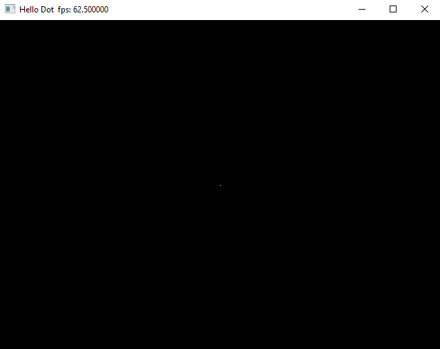
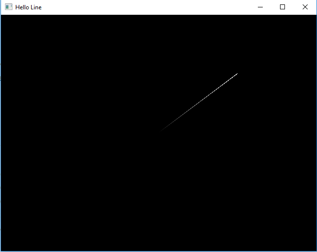
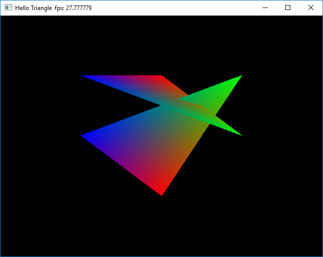
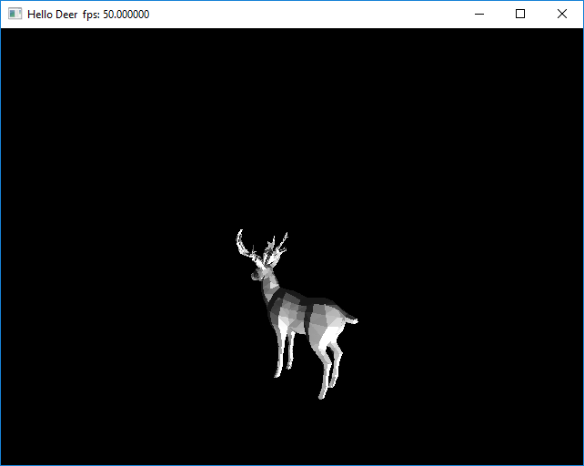
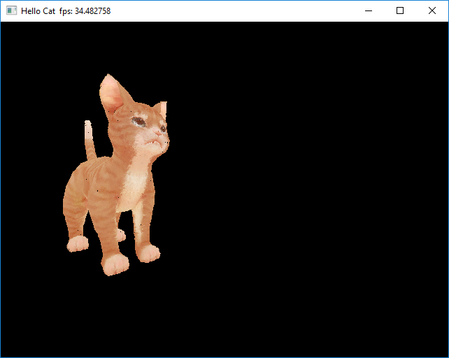

# 3D Engine


> This library is a library mainly uses software to draw the 3D object. It works in software layer and implement some of the algorithms in OpenGL.

This is the summer project of my master degree, which is still being developed. Ones can use this library to create some 3D object and render them in the window. This library does not have a good performance to create a game, but it has more meaning in teaching and learning computer graphics

## New Features!

  - Add texture support
  - Loading 3D object from the obj file


You can also:
  - Render the 2D object and change the color with interpolation
  - Rotate the 3D object
  - Move the camera and zoom object


## Tech

This library use C++ to implement and CMake for project management:

* [C++](https://en.cppreference.com/w/) - C++!
* [CMake](https://cmake.org/) - An awesome tool for C++
* [OpenGL](https://www.opengl.org/) - Only use this library for point
* [GLFW](https://www.glfw.org/) - Use this library to access OpenGL functions
* [stb](https://github.com/nothings/stb) - Use this library for image processing


### Installation

Just put the Rasterization directory in to your project and add it to the CMakeLists.txt
```CMake
add_subdirectory(Rasterization Rasterization)
```


### Development Log
This library has two version, the first version mainly aims to 2D graphics, which can draw circle with a good performaince as well.

The second version is created on 12nd August, which is refacted from the first version, move the multiple threading support and some 2D drawing algorithms.

### Usage
##### Draw a point

```C++
#include "Window/Window.h"
#include "Graphics/Point.h"
int main(){
    Kie::Window window(640,480,"Hello Dot");
    Kie::Point p(0,0,0);
    while(!window.shouldClose()){
        glfwPollEvents();
        window.draw(p);
        window.display();
    }
    return 0;
}
```
And it will display a point at the center of the window.


##### Draw a Line
```C++
#include "Window/Window.h"
#include "Graphics/Point.h"
int main(){
    Kie::Window window(640,480,"Hello Line");
    Kie::Point p1(0.0f,0.0f,0.0f,Kie::Color(0.0f,0.0f,0.0f));
    Kie::Point p2(0.5f,0.5f,0.0f);
    Kie::Line line(p1,p2);
    while(!window.shouldClose()){
        glfwPollEvents();
        window.draw(line);
        window.display();
    }
    return 0;
}
```
And it will display a line in the window.


##### Draw a Triangle
```C++
#include "Window/Window.h"
#include "Graphics/Triangle.h"
int main(){

    Kie::Window window(640,480,"Hello Triangle");
    Kie::Point p1(0.0f,-0.5f,0,Kie::Color(1.0f,0.0f,0.0f));
    Kie::Point p2(0.5f,0.5f,0,Kie::Color(0.0f,1.0f,0.0f));
    Kie::Point p3(-0.5f,0.0f,0,Kie::Color(0.0f,0.0f,1.0f));
    Kie::Triangle tri(p1,p2,p3,true);
    window.printFPS(true);
    while(!window.shouldClose()){
        glfwPollEvents();
        window.clear(Kie::Color(0,0,0));
        window.draw(tri);
        window.display();
    }
    return 0;
}

```
A triangle will be drawn with color interpolation.


##### Draw 3D object
```C++
#include "Window/Window.h"
#include "Graphics/Object.h"
int main() {
     Kie::Window window(640, 480, "Hello Deer");
     Kie::Object deer;
     deer.load("Resource/Path/Of/Deer.ojb");
     deer.setScale(0.01);
     deer.setDistance(100);
     while (!window.shouldClose()) {
        glfwPollEvents();
        window.clear(Kie::Color(0,0,0));
        deer.rotateY(1);
        window.draw(deer);
        window.display();
     }

    return 0;
}

```
A deer will be drawn and rotate 1 degree per frame.


##### Draw 3D object with texture
```C++
#include "Window/Window.h"
#include "Graphics/Object.h"
int main() {
     Kie::Window window(640, 480, "Hello cat");
     Kie::cat cat;
     cat.load("Resource/Path/Of/cat.ojb","./Resource/cat/cat.png");
     cat.setScale(0.01);
     cat.setDistance(100);
     while (!window.shouldClose()) {
        glfwPollEvents();
        window.clear(Kie::Color(0,0,0));
        cat.rotateY(1);
        window.draw(deer);
        window.display();
     }

    return 0;
}

```
A deer will be drawn and rotate 1 degree per frame.


## Future
This library will be continued in the future, which multi-threading and more configurable APIs will be added as expected.

